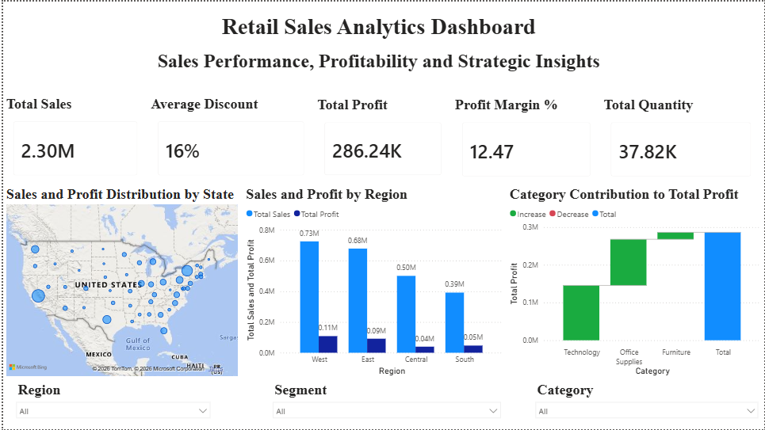
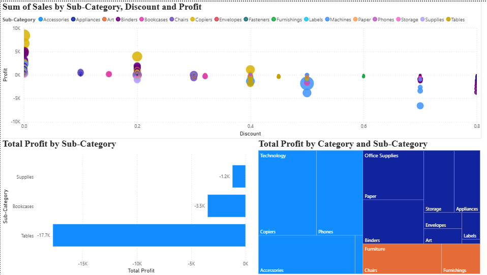
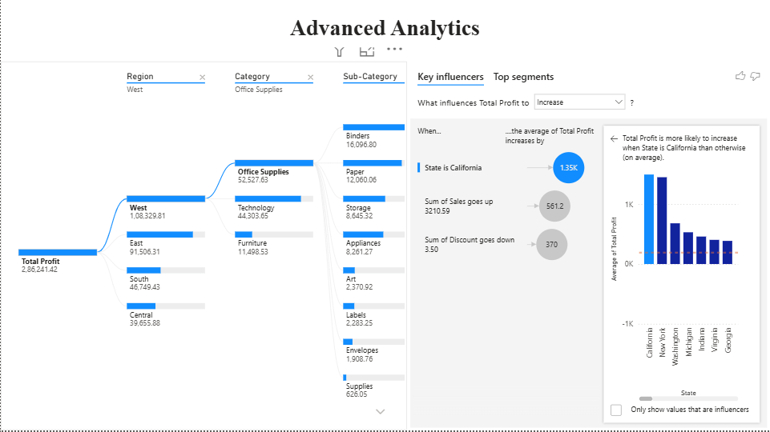
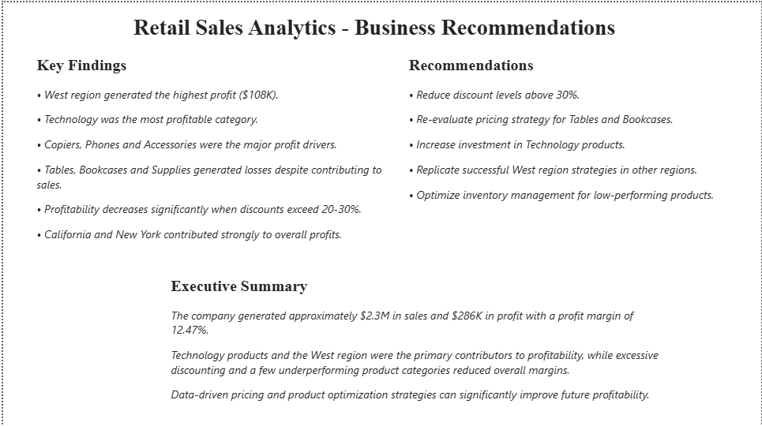

# 📊 Retail Sales Analytics

## 📌 Project Overview

The Retail Sales Analytics project is an end-to-end data analytics solution developed using **Excel, SQL, and Power BI** to analyze business performance, identify profitability drivers, detect loss-making areas, and generate actionable business recommendations.

The project follows a complete analytics workflow:

**Data Cleaning → SQL Analysis → Business Insights → Power BI Dashboard → Strategic Recommendations**

Using approximately **10,000 retail sales records**, the project explores sales trends, customer behavior, regional performance, product profitability, and discount strategies to support data-driven decision making.

---

## 🎯 Business Objectives

The project aims to answer the following business questions:

- Which regions generate the highest sales and profits?
- Which product categories drive business growth?
- Which products are responsible for losses?
- How do discounts affect profitability?
- Which customer segments contribute the most revenue?
- Which states and cities should receive additional investment?
- What strategies can improve long-term profitability?

---

## 🛠️ Technology Stack

- Excel
- SQL (MySQL)
- Power BI

---

## 📂 Dataset Information

- Dataset: Sample Superstore Dataset
- Total Records Analyzed: **9,977**
- Data Type: Retail Sales Transactions

### Dataset Fields
- Sales
- Profit
- Discount
- Quantity
- Region
- State
- City
- Category
- Sub-Category
- Segment

---

## 🔄 Project Workflow

### 1️⃣ Data Cleaning and Validation
- Validated dataset completeness and consistency.
- Checked missing values and duplicates.
- Standardized data types and formatting.

### 2️⃣ SQL-Based Business Analysis
Performed analytical queries to identify:

- Sales and profit by region
- Category performance
- Segment performance
- Top-performing products
- Loss-making products
- Geographic profitability
- Discount impact analysis
- City-level profitability trends

### 3️⃣ Power BI Dashboard Development
Developed a multi-page interactive dashboard containing:

#### Executive Dashboard
- KPI Cards
- Regional Sales and Profit Analysis
- Geographic Performance Map
- Category Profit Contribution Analysis

#### Product Intelligence
- Product Profitability Analysis
- Loss-Making Product Detection
- Discount vs Profit Analysis
- Product Category Performance Analysis

#### Advanced Analytics
- Decomposition Tree Analysis
- Key Influencers Analysis

#### Business Recommendations
- Executive Findings
- Strategic Recommendations
- Profit Optimization Opportunities

---

# 📈 Dashboard Preview

## Page 1 - Executive Dashboard



---

## Page 2 - Product Intelligence



---

## Page 3 - Advanced Analytics



---

## Page 4 - Business Recommendations



---

## 🔍 Key Business Insights

### Regional Insights
- West region generated the highest sales and profits.
- East region demonstrated strong profitability.
- Central region requires margin improvement strategies.

### Product Insights
- Technology emerged as the strongest category.
- Copiers, Phones, and Accessories were major profit drivers.
- Furniture struggled with profitability despite strong sales.

### Customer Insights
- Consumer segment generated the largest share of revenue and profit.
- Corporate segment showed strong growth potential.

### Geographic Insights
- California and New York were the strongest performing states.
- New York City and Los Angeles generated the highest profits.

### Pricing Insights
- Discounts above 20% significantly reduced profitability.
- Discounts above 50% created severe losses.

### Loss Drivers
- Tables were the largest loss contributor.
- Bookcases and Supplies generated persistent losses.
- Texas, Illinois, Ohio, and Pennsylvania underperformed financially.

---

## 💡 Business Recommendations

- Maintain discount levels below 20% whenever possible.
- Reassess pricing strategies for Furniture products.
- Increase investment in high-margin Technology products.
- Replicate successful West region strategies in weaker markets.
- Optimize inventory for underperforming products.
- Review pricing and operational performance in loss-making states.

---

## 📁 Repository Structure

```text
Retail-Sales-Analytics/
│
├── data/
│   ├── SampleSuperstore.csv
│   └── SampleSuperstore_Cleaned.csv
│
├── sql/
│   └── retail_sales_analysis_queries.sql
│
├── dashboard/
│   └── Retail_Sales_Analytics_Dashboard.pbix
│
├── visuals/
│   ├── page1_executive_dashboard.png
│   ├── page2_product_intelligence.png
│   ├── page3_advanced_analytics.png
│   └── page4_business_recommendations.png
│
├── insights/
│   └── business_insights.md
│
└── README.md
```

---

## 🚀 Future Improvements

- What-if discount analysis.
- Sales forecasting models.
- Customer segmentation analysis.
- Predictive profitability modeling.

---

## 👤 Author

**Appana Manvitha**

Final Year Computer Science Engineering Student  
Specialization: **Big Data Analytics**

Interested in:
- Data Analytics
- Business Intelligence
- SQL Analytics
- Power BI Development
- Data Visualization
